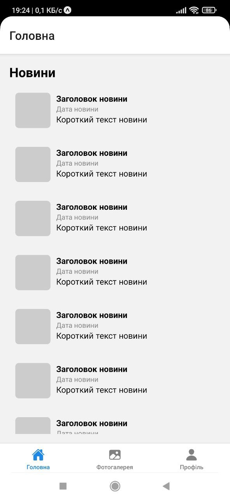
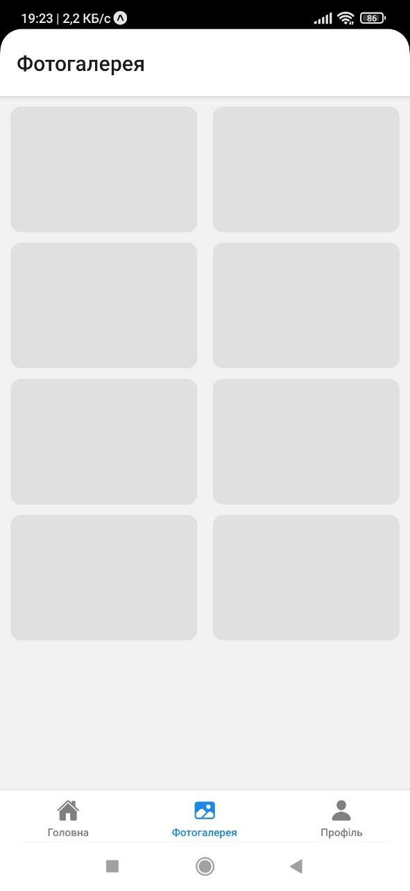
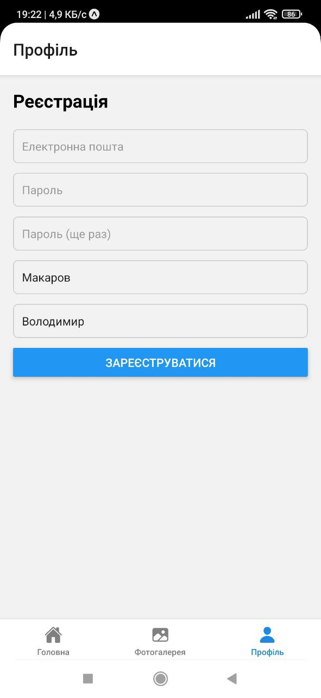

# FirstMobileApp

FirstMobileApp — це простий навчальний мобільний застосунок, розроблений за допомогою React Native та Expo.  
Метою проєкту є демонстрація базової структури мобільного додатка з кількома екранами, навігацією між ними та використанням стандартних компонентів інтерфейсу.

## Опис застосунку

Застосунок містить три основні екрани:

- **Головна (Новини)** — список новин із заголовком, датою та коротким описом
- **Фотогалерея** — сітка зображень
- **Профіль (Реєстрація)** — форма введення даних користувача

Перемикання між екранами реалізоване через нижнє меню вкладок (Bottom Tab Navigation).  

## Використані технології

- React Native
- Expo
- React Navigation (@react-navigation/native, @react-navigation/bottom-tabs)
- Expo Vector Icons (Ionicons)
- JavaScript (ES6)


## Інструкція із запуску

### 1. Встановлення залежностей

```bash
npm install
````

### 2. Запуск застосунку

```bash
npx expo start
```

Після запуску відкриється панель Expo DevTools у браузері.


## Скріншоти екранів застосунку


### Головна (Новини)

### Фотогалерея

### Профіль (Реєстрація)

## Структура проєкту

```
FirstMobileApp
 ├ screens
 │   ├ NewsScreen.js
 │   ├ GalleryScreen.js
 │   └ ProfileScreen.js
 ├ App.js
 ├ package.json
 └ README.md
```