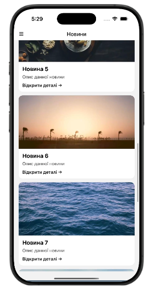
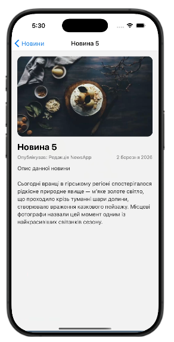
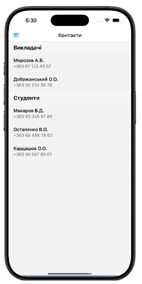
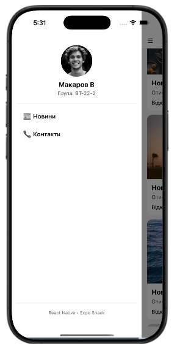

## Локальний запуск

```bash
npm install
npx expo start
```

Після запуску:

* натиснути **i** — iOS Simulator
* або відсканувати QR у Expo Go

---

# Приклади реалізації

## Передача параметрів між екранами

```js
// перехід
navigation.navigate("Details", { item });

// отримання
const { item } = route.params;
```

---

## FlatList з підвантаженням

```js
<FlatList
  data={news}
  renderItem={renderItem}
  keyExtractor={(item) => item.id}
  onEndReached={loadMore}
  onEndReachedThreshold={0.5}
  refreshing={refreshing}
  onRefresh={onRefresh}
/>
```

---

## SectionList (контакти)

```js
<SectionList
  sections={DATA}
  keyExtractor={(item) => item.phone}
  renderItem={({ item }) => <Text>{item.name}</Text>}
  renderSectionHeader={({ section }) => (
    <Text>{section.title}</Text>
  )}
/>
```
# Скріншоти роботи

## Список новин

## Деталі новини

## Контакти

## Бічна панель


---
# Відповіді на запитання

**1. FlatList vs ScrollView**
ScrollView рендерить всі елементи, FlatList — тільки видимі (ефективніше).

**2. Віртуалізація**
Відображення лише видимих елементів списку для економії пам’яті.

**3. Передача параметрів**
Через `navigation.navigate()` і `route.params`.

**4. Вкладена навігація**
Навігатор всередині іншого (Drawer → Stack).

**5. SectionList**
Коли дані потрібно показати по групах/секціях.
---
