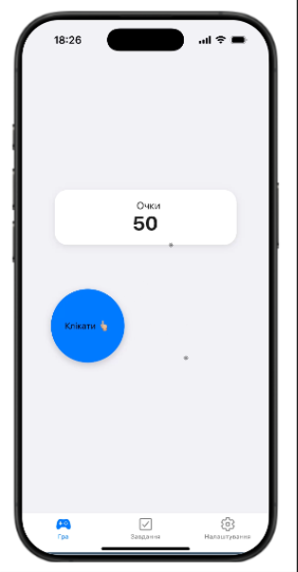
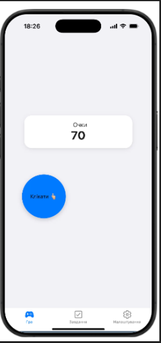
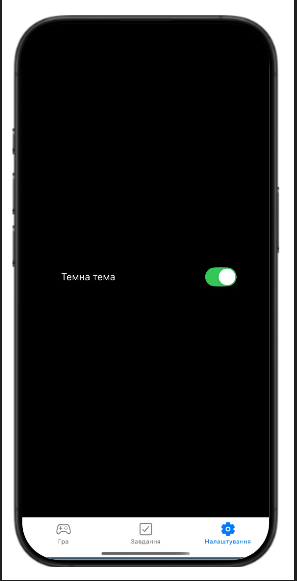
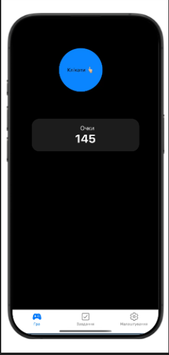
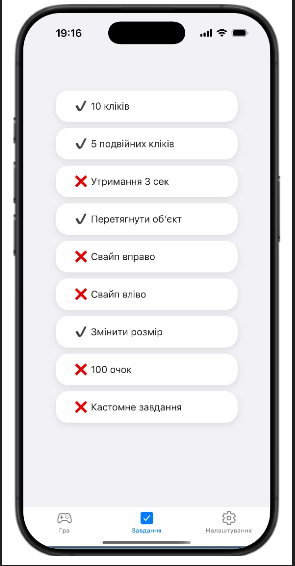

# Clicker Game App

Мобільний застосунок у вигляді гри-клікера, розроблений з використанням React Native та жестових взаємодій користувача.
---

## Структура проєкту

```
Project/
│
├── components/
│   └── ClickObject.js        # Функціонал обєкта
│
├── context/
│   └── GameContext.js        # Функціонал гри
│
├── navigation/
│   └── AppNavigator.js       # навігація
│
├── screens/
│   ├── HomeScreen.js         # головний екран
│   ├── TasksScreen.js        # завдання
│   └── SettingsScreen.js     # налаштування
│
├── styles/
│   └── globalStyles.js       # стилі
│
├── utils/
│   └── tasks.js              # Список завданнь
│
└── App.js                    # Підключення компонентів
```
---
## Функціонал

ClickObject- реалізація кліку над обєктом
```
export default function ClickObject({ styles }) {
  const { addPoints } = useContext(GameContext);

  const scale = useSharedValue(1);
  const x = useSharedValue(0);
  const y = useSharedValue(0);

  const animatedStyle = useAnimatedStyle(() => ({
    transform: [
      { translateX: x.value },
      { translateY: y.value },
      { scale: scale.value },
    ],
  }));

  return (
    <PanGestureHandler
      onGestureEvent={(e) => {
        x.value = e.nativeEvent.translationX;
        y.value = e.nativeEvent.translationY;
        addPoints(2);
      }}
    >
      <Animated.View style={animatedStyle}>
        <PinchGestureHandler
          onGestureEvent={(e) => {
            scale.value = e.nativeEvent.scale;
            addPoints(5);
          }}
        >
          <Animated.View>
            <FlingGestureHandler
              direction={Directions.RIGHT}
              onActivated={() => addPoints(Math.floor(Math.random() * 50))}
            >
              <FlingGestureHandler
                direction={Directions.LEFT}
                onActivated={() => addPoints(Math.floor(Math.random() * 50))}
              >
                <LongPressGestureHandler
                  onActivated={() => addPoints(20)}
                >
                  <TapGestureHandler
                    numberOfTaps={2}
                    onActivated={() => addPoints(10)}
                  >
                    <TapGestureHandler
                      onActivated={() => addPoints(1)}
                    >
                      <Animated.View style={[styles.button]}>
                        <Text style={styles.buttonText}>
                          Клікати 👆🏼
                        </Text>
                      </Animated.View>
                    </TapGestureHandler>
                  </TapGestureHandler>
                </LongPressGestureHandler>
              </FlingGestureHandler>
            </FlingGestureHandler>
          </Animated.View>
        </PinchGestureHandler>
      </Animated.View>
    </PanGestureHandler>
  );
}
```

SettingsScreen.js- реалізація зміни теми в додатку
```
export default function SettingsScreen() {
  const { darkMode, setDarkMode } = useContext(GameContext);

  const theme = darkMode ? darkTheme : lightTheme;
  const styles = createStyles(theme);

  return (
    <View style={styles.container}>
      <View style={styles.switchRow}>
        <Text style={styles.text}>Темна тема</Text>
        <Switch value={darkMode} onValueChange={setDarkMode} />
      </View>
    </View>
  );
}
```
---

## Скріншоти





---

## Висновки

У процесі розробки було:

* реалізовано мобільний застосунок у вигляді гри-клікера
* використано жестові взаємодії користувача
* створено багатосторінкову структуру
* реалізовано управління станом гри
* виконано стилізацію інтерфейсу

Проєкт дозволив закріпити навички роботи з React Native, навігацією та архітектурою мобільних застосунків.


