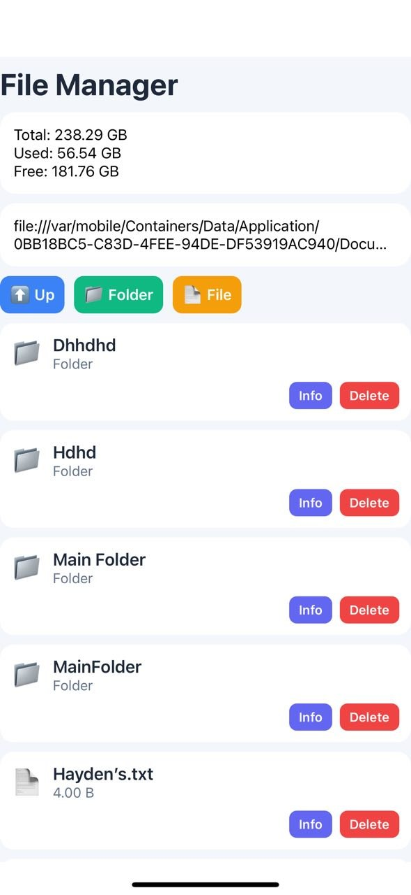
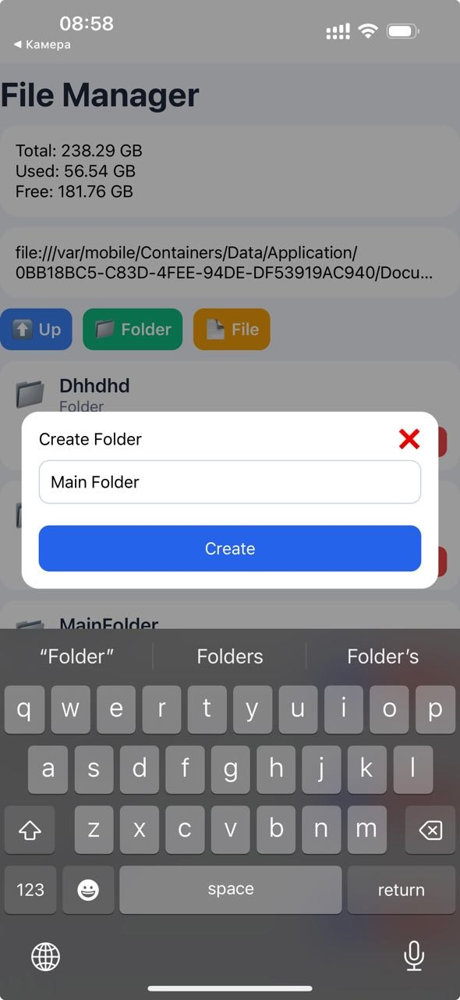

# FileManager App

## Локальний запуск

### Встановелння додатку

```bash
npx create-expo-app FileManagerApp
```

### Встановелння бібліотеки

```bash
npx expo install expo-file-system
```

### Запуск додатку 

```bash
npx expo start --tunnel
```
---
## Структура проєкту

```
Project/
│
├── screens/
│   ├── HomeScreen.js         # головний екран
│
├── styles/
│   └── HomeStyles.js       # стилі
│
├── utils/
│   └── storage.js              #розмір пам'яті пристрою
├── app/
    └── App.js              # Список завданнь
```
---
## Опис функціоналу

SaveFile - збереження файлу
```
const saveFile = async () => {
    await FileSystem.writeAsStringAsync(currentFile, fileContent);
    setEditorModal(false);
    loadDir();
  };
```

OpenItem - ця функція робить відкриття файлу і папки, для редагування інформації 
```
const openItem = async (item) => {
    if (item.isDirectory) {
      setCurrentDir(item.uri + '/');
    } else {
      const content = await FileSystem.readAsStringAsync(item.uri);
      setCurrentFile(item.uri);
      setFileContent(content);
      setEditorModal(true);
    }
  };
```

LoadStorage - відображення розміру пам'яті пристроя
```
 const loadStorage = async () => {
    const data = await getStorageInfo();
    setStorage(data);
  };
```
---

## Скріншоти

### Головний екран

### Інформація про файл

### Створення папки 


