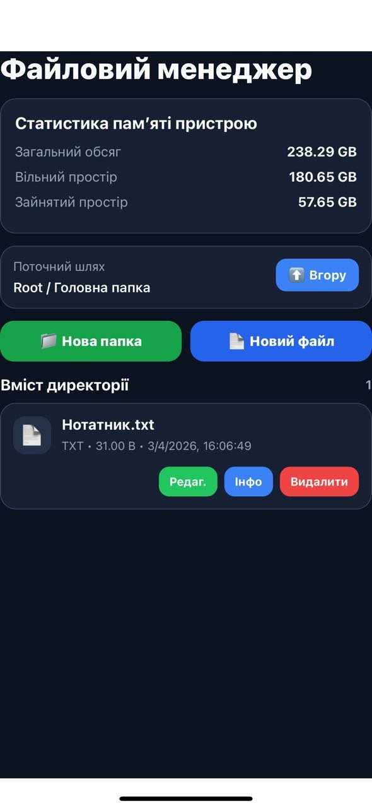
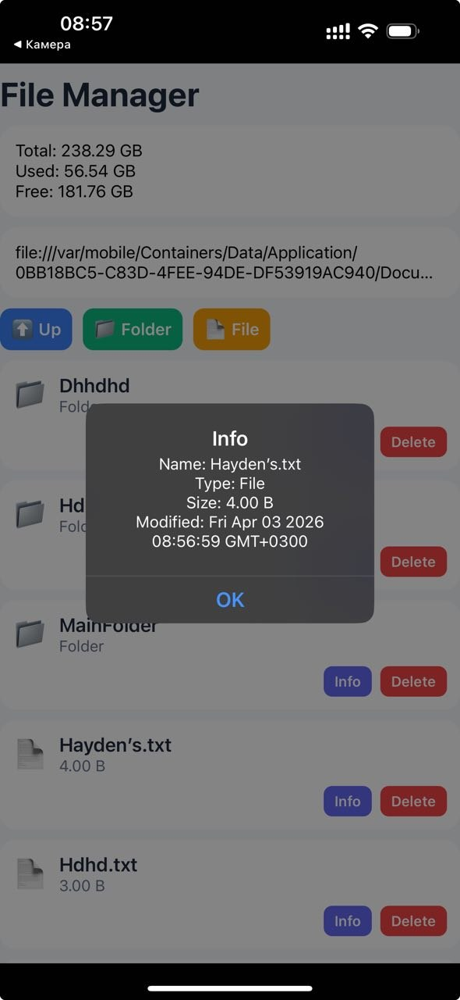
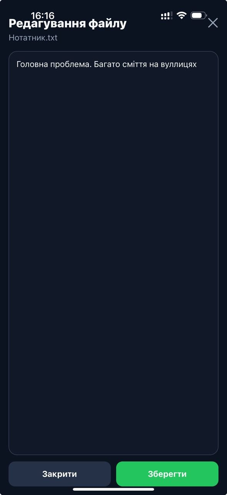

# FileManager App

## Локальний запуск

### Встановелння додатку

```bash
npx create-expo-app FileManagerApp
```

### Встановелння бібліотеки

```bash
npx expo install expo-file-system
```

### Запуск додатку 

```bash
npx expo start --tunnel
```
---
## Структура проєкту

```
Project/
│
├── screens/
│   └── HomeScreen.js
│
├── styles/
│   └── HomeStyles.js
│
├── components/
│   ├── CreateFileModal.js
|   ├── CreateFolderModal.js
|   ├── EditFileModal.js
|   ├── InfoModal.js
|   ├── ItemRow.js
|   ├── MemoryCard.js
|   └── PathBar.js
| 
├── utils/
│   └── storage.js
├── app/
    └── App.js
```
---
## Опис функціоналу

handleCreate - cтворення файлу 
```
const handleCreate = () => {
    const trimmed = name.trim();
    if (!trimmed) return;

    const fileName = trimmed.endsWith('.txt') ? trimmed : trimmed + '.txt';

    onSubmit(fileName, content);
    setName('');
    setContent('');
  };

  const handleClose = () => {
    setName('');
    setContent('');
    onClose();
  };
```

InfoModal - перегляд інформації файла 
```
export default function InfoModal({ visible, item, onClose }) {
  if (!item) return null;
}
```

onRefresh - відображення розміру пам'яті пристроя
```
const onRefresh = async () => {
    setRefreshing(true);
    try {
      const total = await FileSystem.getTotalDiskCapacityAsync();
      const free = await FileSystem.getFreeDiskStorageAsync();

      setMemory({
        total: formatBytes(total),
        free: formatBytes(free),
        used: formatBytes(total - free),
      });

      const data = await readDirectory(currentDir);
      setItems(data);
    } finally {
      setRefreshing(false);
    }
  };

```
---
## Реалізований функціонал

- Загальна інформація пам'яті пристроя
- Видалення і редагування файлів
- Перегляд інформації файлів і папок
- Зручний інтерфейс
---
## Скріншоти

### Головний екран



### Створення файлу 

### Редагування файлу




